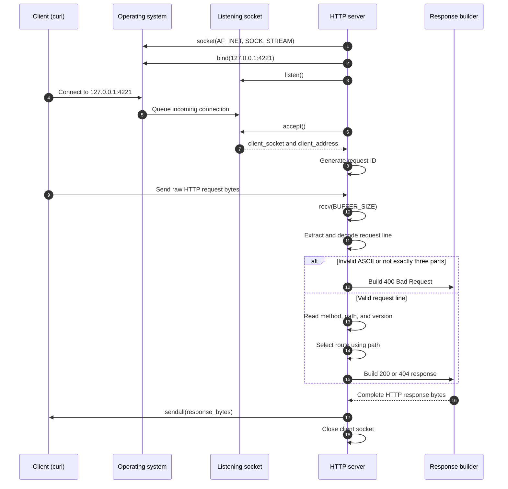

# HTTP Server from Scratch

## Status

Week 1 is complete. This project implements a minimal HTTP/1.1 server directly
on top of TCP sockets and verifies its core behavior with 10 automated tests.

## Learning goal

The goal was not to build a production web framework. The goal was to understand
exactly how one request travels from a client to a server and how the response
travels back.

The complete mental model is:

```text
client request bytes
    -> TCP connection
    -> server receives bytes
    -> server parses the request line
    -> server selects a route
    -> server builds response bytes
    -> TCP connection
    -> client receives the response
```

## Client and server responsibilities

| Side | Responsibility |
|---|---|
| Client | Chooses the server IP address and port |
| Client | Opens a TCP connection |
| Client | Sends an HTTP request as bytes |
| Client | Receives and displays the HTTP response |
| Server | Binds a listening socket to `127.0.0.1:4221` |
| Server | Accepts an incoming connection |
| Server | Reads and validates the request line |
| Server | Selects a route using the request path |
| Server | Builds and sends HTTP response bytes |
| Server | Closes the client connection |

### The two server-side sockets

The listening socket and client socket are different objects with different
lifetimes:

```text
listening socket
    waits for connections for the entire lifetime of the server
             |
             | accept()
             v
client socket
    communicates with one connected client, then closes
```

The listening socket never carries the request body for a particular client.
`accept()` creates a separate connected client socket for that communication.

## End-to-end request workflow



### Step 1 — The server creates a TCP socket

`socket.AF_INET` selects IPv4. `socket.SOCK_STREAM` selects TCP, which provides
an ordered stream of bytes.

At this moment the socket exists, but it has no server address.

### Step 2 — The server binds and listens

`bind((HOST, PORT))` assigns `127.0.0.1:4221` to the socket. `listen()` changes
it into a listening socket that waits for incoming connections.

### Step 3 — The client connects

The client connects to the server IP address and port. The operating system
performs the TCP connection setup and queues the new connection for the server.

### Step 4 — The server accepts

`accept()` blocks until a client connects. It then returns:

- `client_socket`: the connected socket used to communicate with this client;
- `client_address`: the client IP address and temporary source port.

The server generates a request ID for the accepted connection.

### Step 5 — The client sends HTTP request bytes

For example:

```http
GET /health HTTP/1.1
Host: 127.0.0.1:4221

```

The network does not deliver a Python string. The server receives bytes:

```python
b"GET /health HTTP/1.1\r\nHost: 127.0.0.1:4221\r\n\r\n"
```

CRLF (`\r\n`) ends each HTTP line. Two consecutive CRLF sequences
(`\r\n\r\n`) mark the end of the headers.

### Step 6 — The server reads raw bytes

`recv(BUFFER_SIZE)` asks for at most `BUFFER_SIZE` bytes from the TCP stream.

TCP is a byte stream, not a message protocol. One `recv()` call is not
guaranteed to contain a complete HTTP request. Using one call is an intentional
Week 1 simplification.

### Step 7 — The server extracts the request line

The server splits at the first CRLF and keeps:

```text
GET /health HTTP/1.1
```

It decodes those bytes as ASCII. If decoding fails, the server returns
`400 Bad Request` instead of crashing.

### Step 8 — The server parses three fields

An HTTP request line has this structure:

```text
METHOD PATH VERSION
```

For `GET /health HTTP/1.1`:

| Field | Parsed value |
|---|---|
| Method | `GET` |
| Path | `/health` |
| Version | `HTTP/1.1` |

If the request line does not contain exactly three space-separated parts, the
server returns `400 Bad Request`.

### Step 9 — The server selects a route

The current router makes its decision using the path:

| Path | Status | Body |
|---|---|---|
| `/` | `200 OK` | `Hello` |
| `/health` | `200 OK` | `OK` |
| Any other path | `404 Not Found` | `Not Found` |

The method and version are extracted and logged, but are not validated yet.

### Step 10 — The server serializes the response

`build_response()` combines four sections in the required order:

```text
status line
headers
blank line
body
```

An example response is:

```http
HTTP/1.1 200 OK
Content-Type: text/plain; charset=utf-8
Content-Length: 2
X-Request-Id: <generated-id>
Connection: close

OK
```

`Content-Length` is calculated from `len(body)` after the body has become
bytes. The number of encoded bytes can differ from the number of visible Unicode
characters.

### Step 11 — The server sends and closes

`sendall()` keeps sending until all response bytes have been sent or a network
error occurs.

Leaving the `with client_socket:` block closes that one client connection. The
listening socket remains open and waits for the next client.

## Knowledge learned

### TCP and blocking I/O

- A TCP server follows `socket -> bind -> listen -> accept`.
- `accept()` and `recv()` block while waiting for a connection or data.
- TCP transports an ordered byte stream, not complete HTTP messages.
- The operating system manages addresses, ports, connection queues, and socket
  resources.

### Bytes and strings

- `recv()` returns bytes and `sendall()` requires bytes.
- Incoming request bytes must be decoded before string parsing.
- Outgoing response text must be encoded before it can be sent.
- `repr()` exposes control characters such as `\r\n` during debugging.

### HTTP structure

- A request begins with `METHOD PATH VERSION`.
- A response begins with `VERSION STATUS_CODE REASON`.
- Headers and body are separated by exactly `\r\n\r\n`.
- `Content-Length` measures body bytes.
- `X-Request-Id` connects server-side logs with a particular response.

### Parsing, routing, and errors

- Parsing identifies method, path, and version.
- Routing uses the parsed path to select status and body.
- Malformed input receives `400 Bad Request`.
- A valid request for an unknown path receives `404 Not Found`.
- Controlled error responses prevent bad client input from crashing the server.

### Resource lifetime

- The listening socket lives for the lifetime of the server.
- A client socket lives for one request-response exchange.
- Context managers close sockets reliably, including when `continue` is used.

### Testing without a real network

- `test_response.py` checks response serialization as a pure bytes
  transformation.
- `test_server.py` replaces real sockets with `MagicMock` objects.
- `patch()` replaces the socket constructor only during a test.
- A controlled `KeyboardInterrupt` stops the infinite server loop after one
  mocked request.
- The suite covers successful routes, unknown routes, malformed input,
  non-ASCII input, response structure, content length, status, and request IDs.

### Python project configuration

- `pyproject.toml` is the central build, package, dependency, and pytest
  configuration file.
- The distribution name is `systems-lab-http-server`, while the import package
  is `http_server`.
- The `src` layout separates importable code from tests and project files.
- `setuptools` is a build dependency; `pytest` is an optional test dependency.
- `socket` and `uuid` are Python standard-library modules, so they are not
  runtime dependencies in `pyproject.toml`.

## File responsibilities

| File | Responsibility |
|---|---|
| `src/http_server/server.py` | TCP lifecycle, request-line parsing, routing, and connection handling |
| `src/http_server/response.py` | HTTP response serialization |
| `tests/test_response.py` | Five tests for response bytes and headers |
| `tests/test_server.py` | Five mocked-socket tests for server behavior |
| `pyproject.toml` | Build metadata, `src` package discovery, and pytest configuration |

## Run and verify

Start the server from this directory:

```powershell
.\.venv\Scripts\python.exe -m http_server.server
```

Use a second terminal as the client:

```powershell
curl.exe -i http://127.0.0.1:4221/
curl.exe -i http://127.0.0.1:4221/health
curl.exe -i http://127.0.0.1:4221/missing
```

Run all automated tests:

```powershell
.\.venv\Scripts\python.exe -m pytest -v -p no:cacheprovider
```

Expected result:

```text
10 passed
```

## Week 1 limitations

- The server processes one client at a time.
- Each request is read with one `recv()` call.
- Only the request line is parsed; headers and request bodies are not parsed.
- The method and HTTP version are not validated.
- Every response closes the connection; keep-alive is not supported.
- POST handling, file serving, concurrency, TLS, structured logging, coverage,
  and CI are outside the Week 1 scope.
